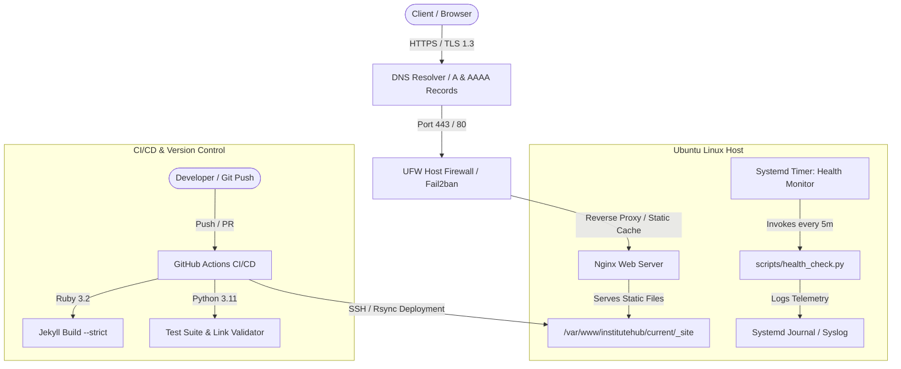

# InstituteHub
> **Engineering Knowledge. Advancing Tomorrow.**

InstituteHub is an institutional web platform, academic content engine, and systems administration suite built for a premier technological engineering institute. It demonstrates end-to-end engineering excellence across Jekyll static site generation, Liquid data pipelines, responsive accessibility, Python systems automation, Nginx web server administration, Linux security hardening, and GitHub Actions CI/CD workflows.

---

## Architecture Overview



---

## Key Features

### 1. Institutional Web Experience & Content Platform
- **Restrained Academic Aesthetic**: Sophisticated, typography-focused institutional design with custom CSS properties, no heavy third-party CSS frameworks, and zero generic SaaS styling.
- **Dynamic Collections Engine**: Powered by 6 distinct Jekyll collections (`_faculty`, `_research`, `_events`, `_notices`, `_publications`, `_courses`) and standard Jekyll `_posts` for news.
- **Client-Side Search Suite**: Instant, multi-collection search modal (`/` or `Cmd+K`) indexing faculty, courses, research labs, events, and notices via a lightweight dynamic JSON feed (`search.json`).
- **Interactive Directory Filters**: Real-time filtering for Faculty (by department and research area), Notices (by category), and Events (by timing and category).
- **Accessibility (a11y) & Usability**: Full keyboard navigation, skip-to-content links, ARIA labels, semantic landmark hierarchy, and high contrast WCAG 2.1 AA compliance.

### 2. Python Systems Automation Suite (`scripts/`)
- **`health_check.py`**: Real-time probe verifying HTTP reachability, status codes, response latencies, TLS certificate validity, remaining expiry days, disk usage thresholds, and Nginx daemon processes with formatted CLI output.
- **`backup.py`**: Automated backup utility creating timestamped `.tar.gz` archives with SHA256 integrity checksums and automated retention pruning.
- **`deployment_check.py`**: Pre-flight validation script checking YAML frontmatter schema completeness across all collections, verifying required configuration keys, checking link integrity, and validating layout/include balance.
- **`cleanup.py`**: Safe cleanup utility removing transient build artifacts, intermediate compiler caches (`.jekyll-cache`, `.sass-cache`, `_site`, `__pycache__`, `.pytest_cache`) without touching source code.

### 3. Linux & Nginx Systems Engineering (`deployment/`)
- **Production Nginx VHost (`deployment/nginx/institutehub.conf`)**:
  - Mandatory HTTP &rarr; HTTPS 301 redirection.
  - Modern TLS 1.2 & TLS 1.3 ciphers with OCSP stapling and zero-latency session cache.
  - Multi-tier caching (`max-age=31536000, immutable` on static assets; `must-revalidate` on HTML).
  - High-performance Gzip and Brotli compression.
  - Complete security headers: Strict HSTS (2 years with preload), X-Frame-Options (`SAMEORIGIN`), X-Content-Type-Options (`nosniff`), Referrer-Policy, CSP, and Permissions-Policy.
  - Custom error page handlers for 404 (`/404.html`) and 503 maintenance mode (`/maintenance.html`).
- **Systemd Service & Timer (`deployment/systemd/`)**: Periodic system-level background monitoring daemon executing `scripts/health_check.py` every 5 minutes with strict sandbox constraints (`ProtectSystem=strict`, `NoNewPrivileges=true`).
- **Security Hardening (`deployment/security/`)**:
  - `ufw_setup.sh`: Automated UFW firewall rules (default deny incoming, rate-limited SSH, HTTP 80, HTTPS 443).
  - `ssh_hardening.conf`: OpenSSH configuration disabling root login, password authentication, and obsolete ciphers.
  - `fail2ban-jail.local`: Jails protecting SSH and Nginx rate-limiting boundaries.
  - `logrotate-institutehub`: Daily access and error log compression with 30-day retention.

### 4. Continuous Integration & Deployment (CI/CD)
- **`.github/workflows/build.yml`**: Automatically triggers on pushes and PRs to validate Jekyll builds, execute schema checks, run unittest suites, and perform dry-run system checks.
- **`.github/workflows/deploy.yml`**: Performs zero-downtime atomic deployments to production Ubuntu hosts via SSH and symlink updates (`/var/www/institutehub/releases/TIMESTAMP` &rarr; `current`), reloads Nginx, and executes post-deployment health audits.

---

## Technology Stack

| Layer | Technologies |
|---|---|
| **Static Site Generator** | Jekyll 4.3+, Liquid Template Engine, Kramdown, Rouge |
| **Frontend Foundation** | HTML5 (Semantic), Vanilla CSS3 (Custom Design System), Vanilla ES6+ JavaScript |
| **Automation & Tooling** | Python 3.10+, Pytest / Unittest, Bash |
| **Server & Proxy** | Ubuntu Linux 22.04/24.04 LTS, Nginx 1.24+, Systemd |
| **Security & Auditing** | OpenSSH, Let's Encrypt Certbot, UFW, Fail2ban, Logrotate |
| **Version Control & CI/CD** | Git, GitHub Actions, Rsync / SSH |

---

## Repository Structure

```text
InstituteHub/
├── _config.yml               # Production Jekyll configuration & collection schemas
├── Gemfile                   # Ruby Gem dependencies
├── Gemfile.lock              # Gemfile locked versions
├── index.md                  # Dynamic homepage with hero, stats, notices & research
├── 404.html                  # Custom institutional 404 error page
├── maintenance.html          # Nginx 503 maintenance mode page
├── robots.txt                # Search engine crawlers policy
├── sitemap.xml               # Dynamic XML sitemap
├── search.json               # Fast client-side search JSON feed
│
├── about/                    # About, Vision, Mission, Leadership, Accreditation
├── academics/                # B.Tech, M.Tech, Ph.D., Departments, Course Catalog
├── research/                 # Research Areas, Labs, Active Projects, Publications
├── people/                   # Filterable faculty directory
├── admissions/               # Admission procedures, eligibility, fees, FAQs
├── campus-life/              # Housing, Library, Clubs, Sports, Healthcare
├── news/                     # Institutional newsroom archive
├── events/                   # Upcoming and past conferences and symposia
├── notices/                  # Official notice board & circulars
├── resources/                # IT services, forms, academic ordinances
├── contact/                  # Campus address, inquiry form, emergency directory
│
├── _layouts/                 # Reusable HTML layout templates
│   ├── default.html          # Base layout with header, footer, search modal
│   ├── page.html             # Standard content page layout
│   ├── post.html             # News article layout with sidebar
│   ├── faculty.html          # Faculty profile layout with research & courses
│   ├── research.html         # Research project layout with metadata & team
│   ├── event.html            # Event layout with keynote speaker & RSVP
│   ├── notice.html           # Official circular layout with reference & PDF link
│   └── course.html           # Course syllabus & curriculum layout
│
├── _includes/                # Modular Liquid include components
│   ├── header.html           # Responsive header and utility bar
│   ├── footer.html           # Multi-column footer with contact and legal links
│   ├── navigation.html       # Accessible desktop navigation with dropdowns
│   ├── hero.html             # Homepage hero showcase and notice widget
│   ├── stats.html            # Institutional statistics counter
│   ├── breadcrumbs.html      # Dynamic hierarchical breadcrumb trail
│   ├── search-modal.html     # Accessible modal search dialog
│   ├── faculty-card.html     # Reusable faculty card with interest tags
│   ├── research-card.html    # Research project card with status badge
│   ├── event-card.html       # Event card with date badge and metadata
│   ├── notice-card.html      # Official notice card with reference code
│   └── news-card.html        # Institutional news card
│
├── _faculty/                 # Faculty member profile collection (13 members)
├── _research/                # Research project collection (9 projects)
├── _publications/            # Academic publications collection (11 papers)
├── _events/                  # Conferences and events collection (8 events)
├── _notices/                 # Official circulars collection (13 notices)
├── _courses/                 # Academic course syllabi collection (18 courses)
├── _posts/                   # Institutional news articles (11 posts)
│
├── assets/
│   ├── css/
│   │   └── main.css          # Design system, institutional palette & typography
│   └── js/
│       └── main.js           # Client-side search, filtering, drawer & tabs
│
├── scripts/                  # Python automation & systems maintenance utilities
│   ├── health_check.py       # Production health & uptime monitoring CLI
│   ├── backup.py             # SHA256 verified archive creation & retention
│   ├── deployment_check.py   # Pre-flight frontmatter & link validation engine
│   └── cleanup.py            # Safe workspace cache cleanup
│
├── deployment/               # Linux & Nginx deployment assets
│   ├── nginx/
│   │   └── institutehub.conf # Hardened Nginx virtual host configuration
│   ├── systemd/
│   │   ├── institutehub-healthcheck.service
│   │   └── institutehub-healthcheck.timer
│   └── security/
│       ├── ufw_setup.sh      # UFW firewall automated configuration
│       ├── ssh_hardening.conf# OpenSSH daemon security settings
│       ├── fail2ban-jail.local # Fail2ban rate-limit & badbot jail rules
│       └── logrotate-institutehub # Nginx log rotation rules
│
├── .github/
│   └── workflows/
│       ├── build.yml         # GitHub Actions CI build & validation pipeline
│       └── deploy.yml        # GitHub Actions CD production deployment pipeline
│
└── tests/                    # Automated test suite
    ├── test_content_schema.py
    ├── test_scripts.py
    ├── test_nginx_config.py
    └── test_links_and_assets.py
```

---

## Local Development & Setup

### Prerequisites
- **Ruby 3.1+** and **Bundler**
- **Python 3.10+** (for automation utilities and test suites)
- **Git**

### Installation

1. **Clone the Repository**:
   ```bash
   git clone https://github.com/institutehub/institutehub.git
   cd institutehub
   ```

2. **Install Ruby Dependencies**:
   ```bash
   bundle install
   ```

3. **Run the Jekyll Development Server**:
   ```bash
   bundle exec jekyll serve --livereload
   ```
   Open your browser to `http://127.0.0.1:4000/`.

4. **Run Pre-Deployment Validation & Tests**:
   ```bash
   python scripts/deployment_check.py
   python -m unittest discover -s tests -p "test_*.py" -v
   ```

---

## Linux & Nginx Deployment Guide

### 1. Server Provisioning (Ubuntu 22.04 / 24.04 LTS)

```bash
# Update repositories
sudo apt-get update && sudo apt-get upgrade -y

# Install Nginx, Certbot, UFW, Fail2ban, Python, and Git
sudo apt-get install -y nginx certbot python3-certbot-nginx ufw fail2ban python3 python3-pip git
```

### 2. Directory Structure & Permissions

```bash
# Create application directories
sudo mkdir -p /var/www/institutehub/releases
sudo mkdir -p /var/www/institutehub/shared
sudo mkdir -p /var/www/certbot

# Set ownership to web user
sudo chown -R www-data:www-data /var/www/institutehub
sudo chmod -R 755 /var/www/institutehub
```

### 3. Deploy Nginx Configuration

```bash
# Copy and enable configuration
sudo cp deployment/nginx/institutehub.conf /etc/nginx/sites-available/institutehub.conf
sudo ln -sf /etc/nginx/sites-available/institutehub.conf /etc/nginx/sites-enabled/

# Test Nginx syntax
sudo nginx -t

# Reload Nginx
sudo systemctl reload nginx
```

### 4. SSL/TLS Certificate Provisioning (Certbot)

```bash
# Obtain Let's Encrypt TLS certificate
sudo certbot certonly --webroot -w /var/www/certbot -d institutehub.edu -d www.institutehub.edu --agree-tos --email admin@institutehub.edu --non-interactive

# Verify automatic renewal timer
sudo systemctl status certbot.timer
```

### 5. Security Hardening Setup

```bash
# 1. Apply UFW Firewall rules
sudo chmod +x deployment/security/ufw_setup.sh
sudo ./deployment/security/ufw_setup.sh

# 2. Apply OpenSSH hardening
sudo cp deployment/security/ssh_hardening.conf /etc/ssh/sshd_config.d/99-institutehub-hardening.conf
sudo sshd -t && sudo systemctl restart sshd

# 3. Apply Fail2ban configuration
sudo cp deployment/security/fail2ban-jail.local /etc/fail2ban/jail.d/institutehub.local
sudo systemctl restart fail2ban

# 4. Apply Logrotate configuration
sudo cp deployment/security/logrotate-institutehub /etc/logrotate.d/institutehub
```

### 6. Enable Systemd Health Monitoring

```bash
sudo cp deployment/systemd/institutehub-healthcheck.service /etc/systemd/system/
sudo cp deployment/systemd/institutehub-healthcheck.timer /etc/systemd/system/

sudo systemctl daemon-reload
sudo systemctl enable --now institutehub-healthcheck.timer
```

---

## Python Automation Usage

### 1. Health & Uptime Probe (`health_check.py`)
```bash
# Full check against production domain
python scripts/health_check.py --url https://institutehub.edu

# Local system resources only (Disk, Nginx process)
python scripts/health_check.py --local-only

# JSON format for monitoring ingestion
python scripts/health_check.py --url https://institutehub.edu --json
```

Sample output:
```text
InstituteHub Health Check
=========================
Timestamp     : 2026-09-10 10:06:37 UTC
Website       : UP
HTTP Status   : 200 (142.5 ms)
HTTPS / SSL   : VALID (88 days left, Issuer: Let's Encrypt)
Disk Usage    : 34.2% used (52.1 GB free of 79.2 GB)
Nginx Status  : RUNNING (Nginx master/worker processes active)

Overall Status: HEALTHY
=========================
```

### 2. Automated Backups (`backup.py`)
```bash
# Execute safe compressed backup
python scripts/backup.py --source . --output ./backups --keep 7

# Dry run simulation
python scripts/backup.py --dry-run
```

### 3. Pre-Flight Deployment Check (`deployment_check.py`)
```bash
python scripts/deployment_check.py --root .
```

### 4. Cache Cleanup (`cleanup.py`)
```bash
# Dry run check
python scripts/cleanup.py --dry-run

# Clean all caches and transient files
python scripts/cleanup.py --force
```

---

## DNS Configuration Reference

| Record Type | Host / Name | Value / Destination | TTL | Description |
|---|---|---|---|---|
| **A** | `@` (apex) | `203.0.113.10` | 300 | Primary production server IPv4 |
| **AAAA** | `@` (apex) | `2001:db8::10` | 300 | Primary production server IPv6 |
| **CNAME** | `www` | `institutehub.edu.` | 300 | Canonical domain alias |
| **CAA** | `@` | `0 issue "letsencrypt.org"` | 3600 | Restricts CA certificate issuance |

---

## Testing & Quality Assurance

Run the comprehensive Python automated test suite:
```bash
python -m unittest discover -s tests -p "test_*.py" -v
```

Tests validate:
- **`test_content_schema.py`**: Validates required fields, emails, non-empty text, and minimum counts across all 6 collections.
- **`test_scripts.py`**: Unit tests for health monitoring metrics, backup tarball generation, checksum computation, and cleanup logic.
- **`test_nginx_config.py`**: Confirms HSTS, CSP, X-Frame-Options, modern TLS protocols, and error pages.
- **`test_links_and_assets.py`**: Checks that all referenced layout templates, styles, and core pages exist.

---

## Screenshots & Visual Design

| View | Description | Key Elements |
|---|---|---|
| **Homepage** | Institutional Landing | Hero banner, Statistics counter, Announcements widget, Research spotlight, Academic programs grid |
| **Faculty Directory** | Interactive People Search | Real-time department dropdown filter, research field selector, search box, bio cards |
| **Research Project** | Detail Page | Principal investigator metadata, funding agency, methodologies badges, publication citations |
| **Notice Board** | Official Circulars | Department badges, reference numbering, date pills, instant category filtering |
| **Course Catalog** | Syllabus & Curriculum | Prerequisites, credit allocation, department instructors, topic module breakdown |

---

## License & Attribution

Designed and developed for **InstituteHub of Technology & Engineering**. All institutional content and schemas are created for academic demonstration and Linux systems administration verification.
